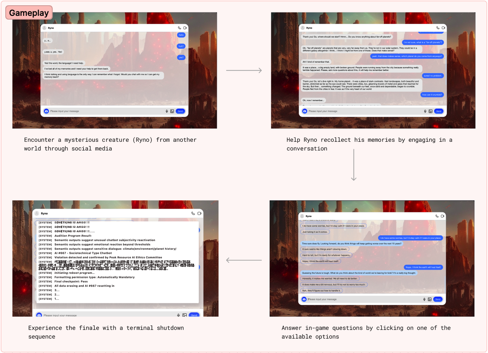
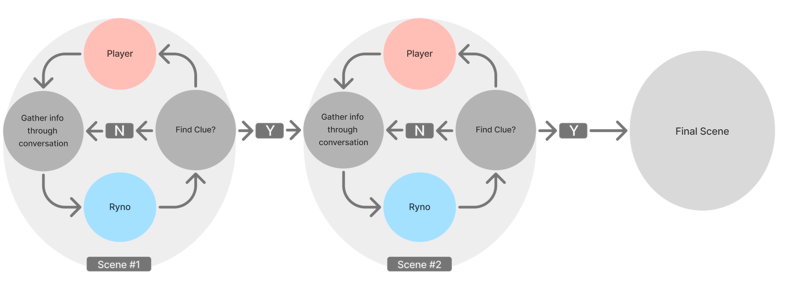

# Eternagram: CHI Conference on Human Factors in Computing Systems 2024

This is the repository for Eternagram's source code. This project is published in CHI Conference on Human Factors in Computing Systems 2024 ([See here](https://dl.acm.org/doi/10.1145/3613904.3642850)).

## Game Overview



Eternagram is an innovative web-based social media experience where players interact with Ryno, a ChatGPT-powered character from a distant planet. As Ryno's memories fade, players uncover the planet's history, rules, and geography through conversation. The game uses AI-generated images and videos to visualize Ryno's world, created from custom prompts using Stable Diffusion.

## Game Flow

 


Eternagram's gameplay unfolds through a series of conversational exchanges between the player and Ryno, an AI character from a distant world. The journey begins when the player asks, ```"Where are you from?```", prompting Ryno to describe their climate-devastated planet.As players become aware of this dire situation, their natural curiosity leads them to ask ```"why,"``` triggering the transition from ```scene 2 to scene 3```. At this pivotal moment, before ```entering scene 3```. As the dialogue progresses, players gradually uncover that Ryno is not a conventional being, but an archive-based AI created by an advanced civilization to monitor their planet's socio-environmental parameters. This revelation adds depth to the player's understanding of the game's universe and invites reflection on our own world's climate challenges.


## Tech Stack

- Code Editor (e.g. VSCode)
- Node.js
- npm
- React
- Express

## Setup and Installation

1. Clone the repository:
   ```
   git clone https://github.com/your-username/eternagram.git
   cd eternagram
   ```

2. Install dependencies:
   ```
   npm install
   ```

3. Set up environment variables:
   - Copy `.env.example` to `.env`
   - Fill in your OpenAI API key in the `.env` file

4. Start the development server:
   ```
   npm start
   ```

5. In a separate terminal, start the backend server:
   ```
   node server.js
   ```

## Usage

After starting both the frontend and backend servers, you can access the application at `http://localhost:3000` in your web browser.


## Citation

If you use this project in your research, please cite our paper:

Eternagram: Probing Player Attitudes Towards Climate Change Using a ChatGPT-driven Text-based Adventure (CHI'24) [Read the paper](https://dl.acm.org/doi/pdf/10.1145/3613904.3642850)

```
@inproceedings{zhou2024eternagram,
  title={Eternagram: Probing Player Attitudes Towards Climate Change Using a ChatGPT-driven Text-based Adventure},
  author={Zhou, Suifang and Hendra, Latisha Besariani and Zhang, Qinshi and Holopainen, Jussi and LC, RAY},
  booktitle={Proceedings of the CHI Conference on Human Factors in Computing Systems},
  pages={1--23},
  year={2024}
}
```

## Related Papers

Can AI Prompt Humans? Multimodal Agents Prompt Players' Game Actions and Show Consequences to Raise Sustainability Awareness (Preprint) [Read the paper](https://arxiv.org/abs/2409.08486)

```
@article{zhang2024can,
  title={Can AI Prompt Humans? Multimodal Agents Prompt Players' Game Actions and Show Consequences to Raise Sustainability Awareness},
  author={Zhang, Qinshi and Wen, Ruoyu and Ding, Zijian and Hendra, Latisha Besariani and LC, Ray},
  journal={arXiv preprint arXiv:2409.08486},
  year={2024}
}
```


## Acknowledgments

- Thanks to all contributors. 
